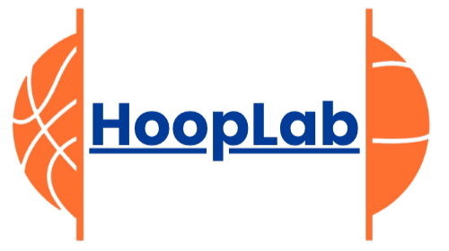

<p align="center"></p>

<p align="center">
  
  
  
  
  
  
</p>


# HOOPLAB 🏀

**HoopLab** es una aplicación web desarrollada con **Laravel** cuyo objetivo es permitir la gestión de ejercicios de baloncesto.  
La aplicación está pensada para entrenadores y jugadores que deseen crear, organizar y consultar ejercicios de forma sencilla e intuitiva.

Incluye autenticación de usuarios y una interfaz moderna basada en componentes reutilizables.

---

## Funcionalidades principales 🧩

- Autenticación de usuarios
- CRUD completo de ejercicios
- Visualización de ejercicios mediante tarjetas
- Paginación de resultados
- Diseño responsive
- Cambio de idioma (Español / Ingles / Francés)

---

##  Tecnologías utilizadas 🛠️

- **<a href="https://laravel.com" target="_blank">Laravel:</a>** Framework PHP utilizado para la estructura del proyecto y la lógica del backend.
- **<a href="https://laravel.com/docs/5.1/blade" target="_blank">Blade:</a>** Motor de plantillas para crear vistas, layouts y componentes reutilizables.
- **<a href="https://tailwindcss.com" target="_blank">Tailwind CSS:</a>** Framework CSS utility-first para el diseño rápido y consistente de la interfaz.
- **<a href="https://daisyui.com" target="_blank">DaisyUI:</a>** Librería de componentes UI basada en Tailwind CSS.
- **<a href="https://sweetalert2.github.io" target="_blank">SweetAlert2:</a>** Librería para alertas y confirmaciones interactivas.
- **<a href="https://www.mysql.com" target="_blank">MySQL:</a>** Base de datos relacional utilizada para almacenar la información del proyecto.
- **<a href="https://laravel.com/docs/10.x/starter-kits" target="_blank">Laravel Breeze:</a>** Starter kit de autenticación con login, registro y verificación de usuarios.

---

## Estructura del proyecto

El proyecto sigue la arquitectura **MVC** de Laravel:

- **Crontroladores:** gestionan la lógica de la aplicación.
- **Modelos:** representan las entidades y la base de datos.
- **Vistas:** contienen las vistas y componentes reutilizables.
- **Layouts y componentes Blade:** permiten mantener una estructura limpia y consistente.
- **Base de datos MySQL:** almacena la información de usuarios y ejercicios.

---

## Instalación ⚙️

1. Clona el repositorio:

```bash
git clone https://github.com/pascual214/gestion_ejercicios.git
cd gestion_ejercicios
```

2. Instala dependencias:

```bash
composer install
npm install
npm run build
```

3. Configura el entorno:

```bash
cp .env.example .env
php artisan key:generate
```

4. Configura la base de datos en .env:

```bash
DB_DATABASE=nombre_bd
DB_USERNAME=usuario
DB_PASSWORD=contraseña
```

5. Ejecuta las migraciones:

```bash
php artisan migrate
```

6. Inicia el servidor:

```bash
php artisan serve
```

---

## Licencia 📄

Este proyecto está licenciado bajo la **Licencia MIT**, lo que permite su uso, copia, modificación y distribución, incluso con fines comerciales, siempre que se mantenga el aviso de copyright original.
